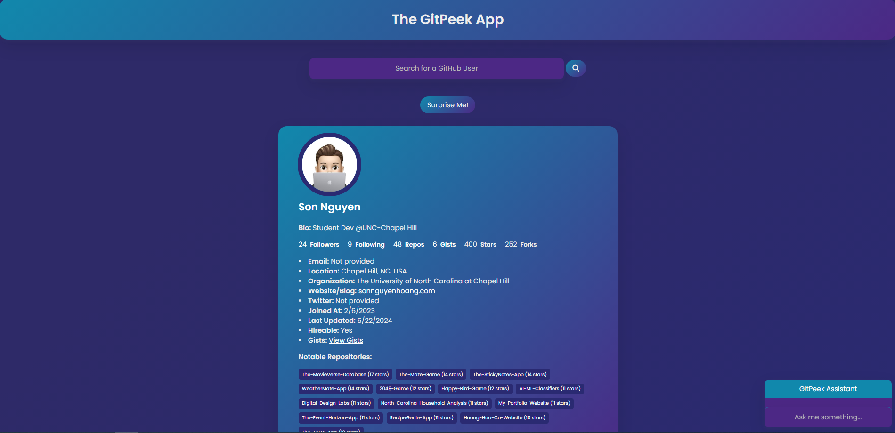

# The GitPeek App

## Description

The GitPeek App is a sleek, user-friendly web application designed to provide quick and comprehensive information about any GitHub user. Simply type in a GitHub username, and get instant access to a variety of data including bio, follower count, repository information, and much more, presented in an elegant and readable format. This app is built with HTML, CSS, and JavaScript, ensuring a lightweight and responsive user experience.

## User Interface

    

## Features

- **User Search**: Easily search for any GitHub user by typing the username into the search bar.
- **Comprehensive User Data**: View detailed information including bio, follower count, following count, repository information, location, company, and much more.
- **Top Repositories**: Discover a user’s top repositories sorted by the number of stars.
- **Dark Mode**: Switch between light and dark themes for optimal readability.
- **User History**: Quickly access previously searched users.
- **User Not Found Page**: Get instant feedback when a searched user is not found, with an option to navigate back to the main page.
- **About Page**: Learn more about The GitPeek App, including its purpose and functionalities.

## How to Use

1. **Search for a User**
   - Type a GitHub username into the search bar and press enter.
   - The app will display detailed information about the user.

2. **View User Repositories**
   - The user’s top repositories are displayed at the bottom of the user card.

3. **Navigate to About Page**
   - Click the "About" button below the user card to learn more about the app.

4. **Toggle Dark Mode**
   - Click the "Toggle Dark Mode" button at the top of the page to switch between light and dark themes.

5. **View Recent Users**
   - Recently searched users are displayed at the bottom for quick access.

6. **User Not Found**
   - If the app cannot find the entered username, it will display a "User not found" message with a button to return to the main page.

## GitHub API Note

This app uses the GitHub API to fetch user data. The API has a rate limit of 60 requests per hour for unauthenticated users (based on IP address). If you encounter any issues with the app, please wait for a few minutes before trying again.

## Local Development

### Prerequisites

- A modern web browser.
- A text editor for editing HTML, CSS, and JavaScript.

### Steps

1. Clone this repository or download the ZIP file.
   - `git clone https://github.com/hoangsonww/The-GitPeek-App.git`

2. Navigate to the project directory.
   - `cd The-GitPeek-App`

3. Open the `index.html` file in your web browser.

4. To view different users, type a GitHub username into the search bar and press enter.

5. Explore other features like dark mode, about page, and user history.

## Technologies Used

- **HTML5**: For structuring the web content.
- **CSS3**: For styling the web content.
- **JavaScript**: For adding interactive features and fetching data from the GitHub API.

## License

This project is open source and available under the [MIT License](LICENSE).

## Contributions

Contributions, issues, and feature requests are welcome! Feel free to check [issues page](https://github.com/yourusername/thegitpeekapp/issues) or open pull requests.

Enjoy using The GitPeek App! 💻🚀
